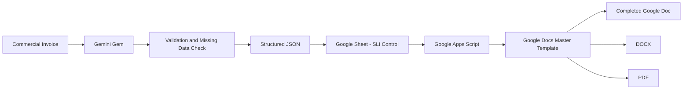

# SLI Export Automation

**AI-assisted automation for preparing Shipper's Letter of Instructions (SLI) for international export shipments.**

This project combines **Gemini, structured JSON, Google Sheets, Google Apps Script and Google Docs** to transform a repetitive manual logistics process into a controlled and repeatable automation workflow.

---

## Project Overview

As part of my work in **Procurement and International Logistics**, I frequently prepare **Shipper's Letter of Instructions (SLI)** for shipments exported from the United States.

Preparing an SLI manually requires reviewing a Commercial Invoice, finding information across different sources, completing multiple fields, validating quantities and units, checking shipment instructions and making sure that nothing important was left incomplete.

It is not necessarily a difficult task.

But it is repetitive, time-consuming and highly dependent on accuracy.

While independently studying **Artificial Intelligence and Data Analytics**, I started looking for opportunities to apply what I was learning to real problems in my daily work.

One of the first questions I asked myself was:

> What repetitive task could I improve using AI and automation?

The SLI became my first real automation project.

---

## The Problem

The original workflow was largely manual.

For every shipment, I had to:

- Review the Commercial Invoice.
- Identify the exporter and consignee information.
- Find shipment-specific information.
- Enter quantities and units of measure.
- Validate commodity information.
- Review weights and values.
- Complete shipment instructions.
- Verify multiple checkboxes.
- Review the document again before sending it.

Some information changed with every shipment.

Other information remained exactly the same.

Some fields required human confirmation.

And some fields should never be guessed.

The main objective became clear:

> Automate as much of the SLI preparation process as possible without sacrificing control, traceability or data accuracy.

---

## First Approach

My first idea was to create a **Gem in Gemini 3.1 Pro** that could:

1. Receive the Commercial Invoice.
2. Extract the shipment information.
3. Ask me for information that was missing.
4. Complete the original SLI document.
5. Return a finished Word document and PDF.

Conceptually, it seemed simple.

In practice, the approach was not reliable enough.

The AI could understand the invoice and the SLI, but consistently manipulating the original Word template while preserving its exact structure and producing dependable final files became a limitation.

That led me to redesign the solution.

---

## Solution Architecture

Instead of asking one AI system to perform every step, I separated the workflow into specialized layers.



The AI is responsible for **extracting and structuring information**.

Google Apps Script is responsible for **deterministic validation and document generation**.

This separation made the workflow much more reliable.

---

## How It Works

### 1. Commercial Invoice Analysis

For every new shipment, the Commercial Invoice is uploaded to the Gemini Gem.

The Gem analyzes the invoice and extracts the information that is clearly supported by the document.

Examples include:

- Exporter information.
- Ultimate consignee.
- Destination country.
- Invoice reference.
- Commodity descriptions.
- Quantities.
- Commercial values.
- Country of manufacture.

The Gem is explicitly instructed:

> Never invent shipment information.

If information is missing, ambiguous or requires human confirmation, the workflow must stop and ask for clarification.

---

### 2. Human Validation

Not every field should be inferred automatically.

Certain shipment or compliance-related fields remain user-controlled.

The Gem asks for any unresolved information before the shipment can continue to automation.

This creates a simple rule:

> Missing information must be resolved before document generation.

The goal is not to remove human judgment.

The goal is to remove repetitive manual work while preserving human control where it matters.

---

### 3. Structured JSON

Once all required information has been resolved, the Gem generates a structured JSON payload.

A simplified example looks like this:

```json
{
  "schema_version": "1.3",
  "status": "READY_FOR_AUTOMATION",
  "shipment_id": "SAMPLE-001",
  "sli": {
    "box_1_exporter_name": "Example Exporter Inc.",
    "box_14_country_destination": "Colombia",
    "cargo_insurance_requested": true,
    "commodities": [
      {
        "box_20_origin": "Foreign",
        "box_21_hts_or_schedule_b": "0000.00.0000",
        "box_21_description": "Sample Product",
        "box_22_quantity": 101,
        "box_23_unit": "Piece",
        "box_24_shipping_weight_kg": null,
        "box_27_export_authorization": "SAMPLE",
        "box_28_value_usd": 10000
      }
    ]
  },
  "missing_fields": [],
  "conflicts": []
}
```

The JSON acts as the bridge between AI-assisted extraction and deterministic automation.

---

### 4. Google Sheet Control Layer

The validated JSON is transferred to a Google Sheet called:

`SLI Control`

Each row represents one shipment.

The control sheet contains:

| Column | Purpose |
|---|---|
| Shipment ID | Unique shipment reference |
| Gem JSON Payload | Structured shipment data |
| Automation Status | Validation and generation status |
| Google Doc | Link to completed document |
| DOCX | Link to exported Word file |
| PDF | Link to exported PDF |
| Generated At | Automation timestamp |

This gives the workflow a simple operational control layer.

---

### 5. Google Apps Script Validation

Google Apps Script reads the JSON before generating any document.

The script checks that:

- The correct JSON schema version is being used.
- The shipment is marked `READY_FOR_AUTOMATION`.
- Required information is present.
- No unresolved missing fields remain.
- No unresolved conflicts remain.
- Commodity information is valid.
- Deprecated JSON fields are not being used.
- Required template placeholders exist.
- Static fields are not accidentally automated.

If validation fails, the automation stops.

The document is not generated until the issue is corrected.

---

### 6. Static vs. Dynamic Fields

One of the improvements made during development was separating **static fields** from **dynamic fields**.

Some SLI fields always contain the same information.

Instead of asking AI to recreate those values for every shipment, they are configured directly in the Google Docs master template.

Other fields are dynamic and are populated automatically from the JSON.

This reduces unnecessary logic and lowers the risk of changing information that should remain constant.

---

### 7. Master Template

The Google Docs master contains controlled placeholders for the fields that change between shipments.

Examples:

```text
<<B1_EXPORTER_NAME>>
<<B2_EXPORTER_ADDRESS>>
<<B11_ULTIMATE_CONSIGNEE>>
<<B14_DESTINATION_COUNTRY>>
<<B40_DATE>>
```

Commodity rows use placeholders such as:

```text
<<I1_B20>>
<<I1_B21>>
<<I1_B22>>
<<I1_B23>>
<<I1_B24>>
```

The Apps Script replaces these placeholders only after the JSON passes validation.

---

### 8. Document Generation

When all validation checks pass, the script automatically:

1. Creates a copy of the Google Docs master template.
2. Replaces the shipment-specific placeholders.
3. Populates the commodity rows.
4. Applies the required insurance selection.
5. Preserves the static fields.
6. Checks that no unresolved placeholders remain.
7. Saves the completed Google Doc.
8. Exports the document as DOCX.
9. Exports the document as PDF.
10. Writes the document links back to the Google Sheet.

The final workflow becomes:

**Commercial Invoice → AI Validation → JSON → Google Sheet → Apps Script → Completed SLI**

---

## A Real Example of the Iteration Process

One of the first versions generated this:

```text
Box 22: 101 Piece
Box 23: N/A
```

But the required output for the workflow was:

```text
Box 22: 101
Box 23: Piece
```

That meant the data model itself had to change.

The original logic was replaced with:

```json
{
  "box_22_quantity": 101,
  "box_23_unit": "Piece"
}
```

Then the Apps Script validation and document-generation logic also had to be updated.

This is representative of how the project evolved:

**Test → Identify the problem → Find the source → Modify → Test again**

Sometimes the problem came from the prompt.

Sometimes it came from the JSON structure.

Sometimes it came from the automation code.

Understanding where the error originated became an important part of the development process.

---

## Handling Shipping Weight

Another example involved shipping weight.

If the source document only provides a **total shipment weight** but does not provide a verified weight for each individual commodity, the automation does not arbitrarily distribute that total weight between products.

Instead:

```json
{
  "box_24_shipping_weight_kg": null
}
```

The corresponding Box 24 remains blank.

This follows one of the main principles of the project:

> If the information is not supported by a verified source, do not invent it.

---

## Validation Philosophy

The workflow is built around five principles:

### 1. Do Not Guess

Missing information must not be invented.

### 2. Separate AI From Deterministic Automation

AI extracts and structures information.

Apps Script validates and generates documents.

### 3. Keep Humans in Control

Fields requiring judgment or confirmation remain user-controlled.

### 4. Stop When Something Is Wrong

The automation should fail visibly instead of silently generating an incorrect document.

### 5. Make Repetitive Work Repeatable

Once the business rules are defined, the same process can be reused across multiple shipments.

---

## Tech Stack

| Technology | Purpose |
|---|---|
| Gemini 3.1 Pro | Invoice analysis and structured data preparation |
| Prompt Engineering | Define extraction and validation behavior |
| Context Engineering | Control how shipment information is interpreted |
| JSON | Structured data exchange |
| Google Sheets | Shipment control layer |
| Google Apps Script | Validation and automation engine |
| Google Docs | SLI master template |
| Google Drive | Generated document storage |
| JavaScript | Automation logic |
| DOCX / PDF | Final document outputs |

---

## Results

The first shipment was used as the main development and testing environment.

During that process, I repeatedly modified:

- Prompt instructions.
- JSON schema.
- Validation rules.
- Static fields.
- Dynamic fields.
- Checkbox behavior.
- Commodity quantity logic.
- Unit-of-measure logic.
- Shipping-weight handling.
- Document-generation behavior.

After stabilizing the workflow, I used it with **6 additional shipments containing different shipment information**.

The automation has now been used across:

## 7 Different Shipments

The first shipment served as the main test case.

The following six shipments were used to confirm that the workflow could operate with different data while preserving the same validation and generation logic.

---

## Before vs. After

### Before

The process required manually:

- Opening the SLI.
- Reviewing the invoice.
- Searching for information.
- Copying values.
- Completing fields.
- Checking boxes.
- Reviewing quantities and units.
- Checking for missing information.
- Rechecking the document before sending it.

### After

The workflow is now:

```text
Commercial Invoice
        ↓
Gemini Gem
        ↓
Missing Data Validation
        ↓
Structured JSON
        ↓
Google Sheet
        ↓
Google Apps Script
        ↓
Completed SLI
        ↓
Google Doc + DOCX + PDF
```

---

## Repository Structure

```text
sli-export-automation/
│
├── README.md
│
├── apps-script/
│   └── Code.gs
│
├── examples/
│   └── sample_payload.json
│
└── docs/
    ├── workflow.png
    ├── sli-before-redacted.png
    └── sli-after-redacted.png
```

---

## Public Repository Safety

This repository is intended to demonstrate the **architecture and automation logic**, not expose production shipment information.

The public version should not contain:

- Real Commercial Invoices.
- Real customer information.
- Production shipment data.
- EIN information.
- Private email addresses.
- Private telephone numbers.
- Confidential business addresses.
- Google Drive folder IDs.
- Google Docs template IDs.
- Credentials or authentication tokens.
- Production export-control data.

Public examples should use fictional or anonymized information.

The original production SLI template is not included in this repository.

---

## Important Disclaimer

This project is an operational automation tool.

It does not replace professional customs, legal, export-control or regulatory review.

Classification, licensing and shipment-compliance decisions should be validated through the appropriate company processes and qualified sources.

---

## What I Learned

I am not a software developer.

My professional background is in **Procurement and International Logistics**.

That became an advantage during this project.

I already understood:

- Which information the process required.
- Which fields changed between shipments.
- Which fields stayed constant.
- Which mistakes mattered operationally.
- Which information should never be guessed.
- What the final document needed to look like.

AI helped me build and troubleshoot technical components that I would not previously have known how to create on my own.

But domain knowledge allowed me to determine whether the result was actually correct.

That has been one of the most important lessons from this project:

> AI can help you build the solution, but understanding the process is what allows you to know whether the solution is working.

---

## Current Version

**Schema Version: 1.3**

**Current Status:** Operational workflow tested with 7 shipments.

---

## Future Improvements

Possible next steps include:

- Reducing manual transfer of JSON into Google Sheets.
- Creating additional automated QA checks.
- Improving shipment history and traceability.
- Adding structured error reporting.
- Creating dashboards for shipment automation metrics.
- Expanding the workflow to other repetitive international logistics documents.

---

## About Me

**Paola Andrea Díaz Montoya**

Procurement & International Logistics professional interested in:

- Artificial Intelligence
- Data Analytics
- Process Automation
- Procurement
- International Logistics
- Supply Chain
- Continuous Improvement

This project was created as part of my journey of applying AI and automation to real operational problems.

---

## Project Status

`Active`

The workflow continues to be refined as additional shipment scenarios are tested.

